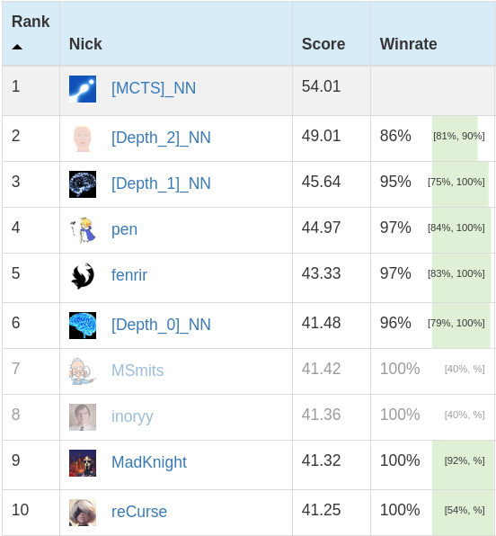

# Mastering a Pod Racing AI Competition with Nash-DQN

In 2017, we (Agade and pb4) had a go at cracking [Coders Strike Back](https://www.codingame.com/multiplayer/bot-programming/coders-strike-back) - an AI programming competition on the [Codingame](https://www.codingame.com/) platform - with Reinforcement Learning methods. Despite unimpressive results at the time, our second attempt took place early in 2019. This endeavor proved to be a huge success: we now occupy the number 1 spot on the leaderboard and have achieved over 95% winrate against Pen's previously uncontested AI.
We are thrilled with this achievement and the fact that we have inspired other players to pursue the same goal. 

CSB is a unique multiplayer game where the widest variety of algorithms have dominated the leaderboard through successive time periods. With this work, we hope to bring new techniques of reinforcement learning on the platform.



## Neural Networks

In this article we assume some knowledge of neural networks (NN). The neural network is a machine learning technique among  others (SVM, Random Forest, k-nearest neighbors...) which is particularly powerful if you have enough data to avoid overfitting. Overfitting happens when your model specialises/memorises a relatively small dataset without learning to generalize to data not part of the training examples. Neural networks were first introduced in the 60s but with improvements and access to the computational power of the GPU the era of so-called deep learning started circa 2012 with [record accuracy](https://papers.nips.cc/paper/4824-imagenet-classification-with-deep-convolutional-neural-networks.pdf) on imagenet. A sufficiently large neural network can learn to mimic most functions from inputs to outputs, given enough (input,output) examples. For this reason NNs are commonly referred to as "function approximators". We used the "vanilla" flavor of dense feed-forward neural networks with leaky rectified linear unit activations (leaky relu) and minibatch gradient descent with momentum. To learn about neural networks we recommend online courses, video series, blog posts and spamming @inoryy.

## Q Learning

### Definitions
Q Learning is originally a tabular reinforcement learning technique applied to games with a finite number of states and actions. The **value of a state** is typically denoted **V**: this would be the evaluation function a lot of Codingame players are used to. **Q(state,action)** represents the evaluation of playing an **action** when the agent perceives the environment's **state**. The Q value represents the expected discounted sum of future rewards assuming perfect play in the future:
```
Q(state,action) = reward_1 + γ*reward_2 + γ^2*reward_3 + ...
```
with γ<=1 a discount factor.
A **policy** is a mapping from perceived states in the environment to actions to be taken in those states.
If an agent knows the exact Q-value function from its environment, an optimal policy may be derived:
```
Policy(state) = action which maximizes Q(state, action)
```

### Tabular Q-Learning
**The goal of Q learning is to learn the Q values corresponding to perfect play**. Tabular Q learning starts with a randomly initialized grid of size N\_States\*N\_Actions and iteratively converges to the true Q values by playing the game and applying the Bellman equation to every (state,action)->(next_state) transition the AI experiences:
```
Q(state, action) = immediate_reward(state, action) + γ*max_over_possible_actions( Q(next_state, possible_action))
```
It is allowed for γ to be 1 in finitely long games, but for infinitely long games γ<1 otherwise Q values are infinite. γ also serves to make the AI collect rewards sooner rather than later as future rewards are discounted.

While Tabular Q-Learning works well and is guaranteed to converge, it is often limited due to the large action-state table that must be built.
### Deep Q-Learning

In 2013 Deepmind published the Deep Q learning [paper](https://arxiv.org/pdf/1312.5602.pdf) (DQN). Neural networks offer generalization capability which allows to approximate the (state, action) table for larger and even continuous state-action spaces. Instead of looking up Qs in a table, you would feed in a representation of the state action pair and the network would output the Q value. For computational efficiency the network outputs the Q values for all actions of a given state in one forward pass. This technique is called Deep Q Network (DQN).

While the use of neural networks allows learning in larger state-action spaces, the algorithm no longer provides any theoretical guarantee of convergence. Various techniques described below are used to improve the likelihood of converging towards a good approximation of the Q-values.

Techniques described in the DQN paper include: 

* Gradient clipping to avoid destroying the network by backpropagating huge gradients on transitions the network really doesn't understand.
* Experience replay memory to store transitions and backpropagate gradients from a mixture of different states. As opposed to only learning from the current transition.
* Freezing a copy of the network to be used as a "target network" for the right side of the Bellman equation. Said copy is updated to the current weights of the network every time a target number of training steps is reached. `DQN(state,action):=immediate_reward+γ*maxDQN_Frozen(next_state,action)`

Deepmind has since published several papers improving upon DQN. For example Deep Double Q learning (DDQN) where, on the right side of the Bellman Equation instead of taking the maximum over actions, the action that the current network would have chosen is taken as target.
```
target_action=argmaxDQN(next_state,action)
DQN(state,action):=immediate_reward+γ*DQN_Frozen(next_state,target_action)
```

See the [paper](https://arxiv.org/pdf/1509.06461.pdf) for a more detailed explanation.

A major improvement we also used is prioritised experience replay where instead of selecting memories uniformly at random from the memory, transitions which are most misunderstood by the network have a higher probability of being selected. When transitions are experienced they are added to memory with a high priority, to encourage that transitions are learned from at least once. And when a transition is selected its Temporal Difference Error (TD Error) is measured and its priority is updated as:
```
prio = (epsilon_prio+TD_Error)^prio_alpha
```
where the TD Error is the error on the supposed equality in the Bellman equation. We used the proportional prioritisation variant mentioned in the [paper](https://arxiv.org/pdf/1511.05952.pdf). This used a sum-tree data structure in order to be able to select samples according to priority in logarithmic time.
```
P_prioritized = Sample_prio/Total_Prio_In_Sum_Tree
```
Because samples are selected according to a different distribution to the distribution with which these transitions are experienced, an importance sampling (IS), correction is applied to the gradient:
```
IS_Correction = P_uniform/P_prioritized = Sample_prio/(Memory_Size*Total_Prio_In_Sum_Tree)
```

## Training a single runner

Q-Learning was first applied to train a single runner in an infinite environment, where the objective is to pass checkpoints as fast as possible. As such, the game is described in a very simplified way:
* No lap number
* No timeout
* No opponent
* No allied pod
* No game ending
* Only the two next checkpoints are known
 
Rewards at each step are defined as follows:
 - +1 when the runner takes a checkpoint
 - 0 otherwise
  
 The runner considers 6 possible actions at each step:
```
[thrust 200 ; rotate left ]
[thrust 200 ; no rotation ]
[thrust 200 ; rotate right]
[no thrust  ; rotate left ]
[no thrust  ; no rotation ]
[no thrust  ; rotate right]
```
When compared to the best runner we could find (Bleuj's depth 12 Simulated Annealing double runner bot), our runner was only 5% slower to complete a race on average.
This runner learns to complete a full race within 30 seconds of training and converges to its best performance after 1 hour of training.

## Training a blocker against a fixed opponent

Q-Learning was described above as a value-based technique where an agent learns a value function over all (State, Action) pairs by interacting with its environment.

If the runner is considered as part of the environment, a blocker can be trained with the same Q-learning framework that was described for the runner alone.

Rewards at each step are defined as follows:
 - -1 when the runner takes a checkpoint
 - 0 otherwise

### Limitations
While this would be the perfect method to specialize against a specific bot on the leaderboard, one can not consider that the blocker will learn a good policy overall.
Indeed, with this approach the blocker learns an optimal policy against a "static" runner which never learns to improve.

### Results
This approach was used in 2017 in the following manner:

    (1) Train a runner alone
    (2) Train a blocker against (1)
    (3) Train a runner against  (2)
    (4) Train a blocker against (3)

A bot was submitted on the leaderboard combining the runner (3) and the blocker (4), it reached rank 30 in legend league.

Other agents were trained by repeating more iterations, but those agents performed worse overall on the leaderboard.

    (5) Train a runner against  (4)
    (6) Train a blocker against (5)
Our understanding is that blocker (6) has learned to block a runner which tries to go around the blocker. Blocker (6) was never placed in an environment against runner (1) which goes straight to the checkpoint: hence the blocker's inability to obstruct runner (1)'s path.


## Simultaneous runner/blocker training
### Failed attempt #1
#### Description
As discussed above, the main limitation we were faced with originated from the fact that only one agent learned to improve its policy from the environment while the other agent had a fixed policy.
We created an environment in which two neural networks interacted: one controlled the blocker, the other one controlled the runner.
In a Q-learning framework, each agent predicted the expected future discounted reward for the 6 actions it was allowed to perform.
Our hope was to train both agents simultaneously so that they would converge towards an optimal adversarial strategy.
#### Results
Upon training and submitting the code on CG servers, the results obtained were disappointing.
Our implementation may have been lackluster, as discussions with people familiar in the field have shown that "*it should have worked.*"

### Failed attempt #2
#### Description
Same as above, but with one neural network with 12 output values instead of two neural networks with 6 output values each.
#### Results
Same as above. We made two completely independent implementations of this technique with bad results in both cases.

### Attempt #3: The Breakthrough !
#### Inspiration from Minimax Q Learning
Success came with inspiration from this [paper](https://www2.cs.duke.edu/courses/spring07/cps296.3/littman94markov.pdf) which describes a combination of Q learning and Minimax, the classic algorithm used for example by Stockfish in chess. Just like Q learning the paper dates from before the era of deep learning but can be adapted to neural networks, just like the DQN paper did with Q learning.

The neural network outputs a matrix of Q values for each possible pair of actions of both players. Once the proper Q values have been learned by the network, the [N_Actions,N_Actions] matrix of Q values can then be used, in alternating-turn games to perform a classical minimax search, and in simultaneous-turn games to use techniques like matrix-game solvers. Because CSB is a simultaneous-turn game we will focus on the latter.

Our implementation differs from the paper in that we do not consider in Bellman's equation that the opponent takes the best action against our mixed strategy: both agents are forced to play their optimal mixed strategies to evaluate a state's value. Whereas the Minimax Q learning paper suggests learning to play the mixed policy which maximises the worst case reward, we have players play their Nash equilibrium strategy. For this reason we thought to call this Nash-DQN. We then found [this paper](http://www.jmlr.org/papers/volume4/hu03a/hu03a.pdf) as prior art which mentions this idea in the tabular Q learning case.

#### Details

For solving zero-sum simultaneous matrix games we used [this iterative algorithm](http://code.activestate.com/recipes/496825-game-theory-payoff-matrix-solver/), linked in [Swagboy's Xmas Rush postmortem](https://www.codingame.com/forum/t/xmash-rush-cc07-feedback-strategies/74346/26). As you may know, in a simultaneous-turn game, the notion of optimal move is replaced by the notion of optimal mixed strategy. For example in rock paper scissors, no one action is optimal, the mixed strategy [1/3,1/3,1/3] is. Given a matrix game, the previously linked solver, will find, given enough iterations, the Nash equilibrium mixed strategy for both players.
With these mixed strategies, the value V of any state can also be calculated as the probability of each action pair multiplied by its Q value:
```
float Mixed_Strat_And_Q_To_Value(Mixed_Strat_P1,Mixed_Strat_P2,Q_Values){
	float value{0};
	for(int p1_action_idx=0;p1_action_idx<N_Actions;++p1_action_idx){
		float proba_1{Mixed_Strat_P1[p1_action_idx]};
		for(int p2_action_idx=0;p2_action_idx<N_Actions;++p2_action_idx){
			float proba_2{Mixed_Strat_P2[p2_action_idx]};
			value+=proba_1*proba_2*Q[Index_fct(p1_action_idx,p2_action_idx)];
		}
	}
	return value;
}
```
As we discussed, in classical 1 player versus environment Q learning the bellman equation is given by
```
Q(state,action) = immediate_reward+γ*maxQ(next_state,action)
```
which can be rewritten as
```
V(next_state) = maxQ(next_state,action)
Q(state,action) = immediate_reward+γ*V(next_state)
```
because the value of a state is naturally the sum of expected rewards from it by playing the best action. In the same way in minimax Q learning, for a simultaneous-move game, the Bellman equation is given by:
```
array<float,N_Actions*N_Actions> Q_Values = Minimax_Deep_Q_Network(next_state);
pair<Strategy, Strategy> Mixed_Strats = Matrix_Game_Solver(Q_Values);
V(next_state) = Mixed_Strat_And_Q_To_Value(Mixed_Strats,Q_Values)
Q(state,action) = immediate_reward+γ*V(next_state)
```
As mentioned above, the Minimax Q learning paper gives a different formula for the bellman equation at the bottom left of page 3.

Now that we have transformed the problem back into the framework of 1 network controlling agents in an environment, we can use all the techniques of Deep Q Learning, Deep Double Q learning, prioritized experience replay etc... With this method we were able to train a runner and a blocker into some approximation of the Nash equilibrium which reached very high levels of play on the leaderboard, easily rivalling all other search methods currently on the leaderboard.

Training from scratch, in our best implementations:
 - the runner learns to finish races within 30 seconds of training
 - the blocker will *wake-up* and make the runner timeout its first race after 7 minutes of training
 - within 30mn of training, the AI challenges pen on the leaderboard
 - within 12-24hours (*hard to tell...*) the network has converged and ceases to improve

## Results
See figure at the top of the article to learn more about the relative strength of the versions described below.
### Vanilla (Depth 0)
Our Q-Learning framework trained a neural network to predict the expected future discounted rewards for the runner for pair of actions taken by the runner and the blocker on this turn.
The iterative matrix-game solver is applied to the output to provide optimal mixed strategies for both agents in this zero-sum simultaneous game.
An action is sampled from our agents' mixed strategies and played. We call this approach "Depth 0" because there is no tree-search involved in the process.
### Depth 1
Given the mixed strategies and payoff matrix described in the *Depth 0* section, one can trivially calculate the gamestate's current value.
This is usually called on CodinGame an "evaluation function", which can be plugged in many different search algorithms.
In a Keep It Simple and Stupid approach, we went for an exhaustive depth 1 search.
### Depth 2
With improved calculation speed, the Neural Network was also plugged in a Depth 2 exhaustive search.
### MCTS
In our final - and best - version, a full fledged MCTS search was deployed and obtained 99% winrate (only 2 losses) during its 220 placement games.
### Emergent behavior
[In this replay](https://www.codingame.com/replay/370528771?f=340), the red blocker decides to face away from the orange runner and shield continuously. Seeing how it took 80 turns for the runner to push the blocker forward, this is an effective strategy.
The authors never witnessed such a behavior in CSB games played with classical search algorithms and hand-crafted evaluation functions before.

## Other Algorithms
We used Q learning but it is important to understand there are many other reinforcement learning algorithms which could be used. For example, fenrir recently made a very strong bot using a flavor of the [A2C](https://medium.freecodecamp.org/an-intro-to-advantage-actor-critic-methods-lets-play-sonic-the-hedgehog-86d6240171d) algorithm. This algorithm is part of a broader family of policy gradient algorithms, where instead of learning a value function as in Q learning, a policy is learned. One argument in favor of such methods is that learning a policy is in principle simpler because it is intuitively easier to decide which move is best, than it is to understand the precise value one can expect from playing a move.

An other, very famous, algorithm one could use is [Alpha Zero](https://arxiv.org/pdf/1712.01815.pdf), where a network outputs both a policy and a value in a given state and a Monte carlo tree search is used as a target to improve the policy and value. As searching is inherently part of the algorithm, it is even more convenient than our Q learning approach to use the 75ms to enhance play. And as we saw, using a MCTS search on top of our Q values gave very large improvements.

# Appendix
## Training behavior: First Iterations
Figures showing raw metrics extracted from one training run.
Contrary to best practices, most metrics shown below have not been described in the article. This is a deliberate omission: the definition of most metrics would lead us to disclose most of the values used for our training hyper-parameters.
The figures below illustrate the fact that it took:
- 200 steps for the runner to learn a good policy
- 800 steps for the blocker to start impacting the runner
- 1000 steps for the runner and blocker to reach good equilibrium


## Training behavior: All Iterations
The figures below illustrate the fact that:
- it takes a very long time for the Temporal Difference error metric to reach a stable position
- all other metrics have converged

Empirically, we believe that the network stopped improving it terms of *TrueSkill score when submitted on CG* after 4000 steps.


## Passing the 100ko code size limit
In order to use neural networks on CG, a major obstacle has to be overcome: the 100ko code size limit. This is due to having to include the weights of the neural network in the file. What we do is compile the AI locally and send the binary in a base85 encoding via [this tool](https://github.com/Agade09/CG-Send-Binary). You would need roughly 12 characters (12 bytes) to represent a 4 byte float in plain text code (e.g: 1.2345678e10). By compiling the float is properly represented as 4 bytes in binary format. Unfortunately to send the binary you have to convert to a text format. The most efficient you can do on ascii characters is base85 which inflates the size by 25% (every 4 bytes of binary is represented with 5 plain text characters). Further code size can be saved by stripping the binary and compressing with upx. One can also quantize the network and upload weights of arbitrary precision (e.g: 13 bits) by storing the coefficient array as a bitset. There are also many compiler options and tricks which are used for example in the embedded systems world to minimise code size.

It is also possible, as fenrir did, to compress only the coefficients and upload unobfuscated mostly-plain-text code to CG.

## If you want to try...
### Supervised learning
Having introduced Q learning, let's talk about the simplest objective you can set yourself as a "Hello world" to get started. 
One thing you can do is take an existing AI and learn to copy its actions by training a neural network via supervised learning. If you are confident you have a working neural network implementation, you can then try your hands at reinforcement learning. The simplest game to do so on CG, to our knowledge is CSB.
[Here is a ready-made set of datapoints from which you may learn.](https://drive.google.com/file/d/0BwV4JhqN8FZaNWdKMldFNjVYRUU/view)
Fun-fact : pb4 successfully trained his first neural network within Excel based on the dataset above.
### Reinforcement learning
You can train a single runner to pass checkpoints as fast as possible with DQN in a 1 pod versus no enemies environment. The state can be represented with less than a dozen floating point values encoding the position of the next 2 checkpoints relative to the pod, its current speed and its current angle. If you successfully train a runner agent, you can play greedily according to the Q values for both of your pods and thus make a double runner AI which in our experience can reach approximately rank 150 in legend.
If you can successfully do this you'll have achieved your first RL AI. In order to reach higher on the leaderboard training a blocker and a runner than can deal with blockers will be necessary.
